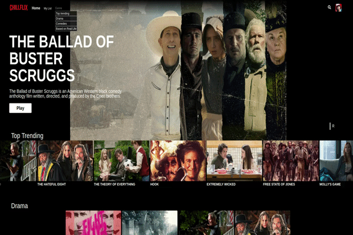

# Chillflix

[Live!](http://chillflix.herokuapp.com/)

Chillflix, a full stack Netflix clone, is a video streaming application that allows users to watch trailers on demand.

It's been developed using Ruby, Ruby on Rails, PostgresQL, Ajax, React, Redux, HTML5, Scss.

Chillflix, a full stack Netflix clone, is a video streaming application that allows users to watch trailers on demand.

I have created functionalities such as User Auth, Movie trailers Index + Movie show Pages, Genres, Search feature, and Movies Playlist.

## Table of Contents

- [Technologies used](#Technologies)
- [Features](#features)
- [User Authentication](###1.-User-Authentication)
- [Movie trailers Index + Movie show Pages](###2.-Movie-trailers-Index-+-Movie-show-Pages)
- [Genres](###3.-Genres)
- [Search](###4.-Search)
- [Playlist](###5.-Playlist)

---

# Technologies Used

Ruby, Ruby on Rails, PostgresQL, Ajax, React, Redux, Aws, HTML5, Scss.

---

# Features

### 1. User Authentication

Chillflix has a User authentication feature which allows them to create their account and have access to the app full functionalities such as creating a playlist, searching for a trailer, watch a trailer on demand.

In addition to making fields required in the frontend, the attributes are also validated in the `user.rb` model.


```
class User < ApplicationRecord

    attr_reader :password

    validates :email, :session_token, presence:true, uniqueness: true
    validates :password_digest, presence: true
    validates :password, length: { minimum: 6 }, allow_nil: true

    after_initialize :ensure_session_token

    has_one :mylist,
    foreign_key: :profile_id,
    class_name: :MyList

    has_many :list_movies,
        through: :mylist,
        source: :movie


    def self.find_by_credentials(email, password)
        user = User.find_by(email: email)
        if user && user.is_password?(password)
            user
        else
            nil
        end
    end

    def password=(password)
        self.password_digest = BCrypt::Password.create(password)
        @password = password
    end

    def is_password?(password)
        BCrypt::Password.new(self.password_digest).is_password?(password)
    end

    def reset_session_token!
        self.session_token = SecureRandom::urlsafe_base64(32)
        self.save!
        self.session_token
    end

    def ensure_session_token
        self.session_token ||= SecureRandom::urlsafe_base64(32)
    end

end
```

---

### 2. Movie trailers Index + Movie show Pages

A movie trailers index page is rendered when the user logs in or when clicking "Home" on the nav bar.

Under it, the genres are listed inside carousels with movie trailers filtered for each genre.

Users can hover over the movie images thumbnail under each genre to reveal additional trailer informations and the "Play" button which, once clicked, renders the movie trailer show page allowing the user to watch the trailer on-demand.

Images and video trailers are hosted on `AWS S3`.


```
class HomeComponent extends  React.Component {
    constructor(props) {
        super(props);
    }

    componentDidMount() {
        this.props.fetchAllGenres();
    }

    render() {

        if (this.props.genres.length < 4) return null;


        return(


            <div className='home-outer-wrap' >

              <NavbarComponent/>

                <HeaderComponent />


                <div className="browse-genre-rows">
                    {this.props.genres.map((genre) => (

                    <div className="browse-row" key={genre.id}>

                        <h2 className="row-title" >{genre.genre_name}</h2>
                        <CarouselComponent  myList = {this.props.currentUser.myListMovieIds} genreMovies={genre.genreMovies} />

                    </div>
                    ))}
                </div>


            </div>
        )
    }
}

export default HomeComponent;
```

---

### 3. Genres

Users can select a genre in the nav bar genre dropdown list. This takes them to the genre show page.

Similar to the movie trailers' index page, users can can hover over the movie images thumbnail under each genre to reveal additional trailer informations and the "Play" button which, once clicked, renders the movie trailer show page allowing the user to watch the trailer on-demand.

The displayed trailers are passed to the component using `mapStateToProps` and are fetched using a custom action which takes advantage of `Ruby on Rails` associations and `json.jbuilder` data format.



```
json.extract! genre, :id, :genre_name
json.genreMovies genre.movies.each do |movie|
    json.partial! 'api/movies/movie', movie: movie
end
```

```
import { connect } from 'react-redux';
import {withRouter} from 'react-router-dom';
import { fetchGenre } from '../../../actions/genre_actions';

import genreComponent from './genre_component';

const mapStateToProps = ({ session, entities: { users, movies, genres } }, ownProps) => {
    return {
        currentUser: users[session.id],
        genre: genres,
        genreId: parseInt(ownProps.match.params.genreId)
    };
};

const mapDispatchToProps = dispatch => {
    return {
        fetchGenre: (genreId) => dispatch(fetchGenre(genreId)),
    };
};

export default withRouter(connect(mapStateToProps, mapDispatchToProps)(genreComponent));
```

---

### 4. Search

The Search feature is managed filtering the user's input and updating the `redux` slice of state that allows the rendering of the trailers which title matches the input.
On click the selected movie is fetched from the database through its index, accessing data in `constant time`.

```
handleSearch(e) {
        this.setState({search: e.target.value})
    }


    handleSubmit(e) {
        e.preventDefault()
        const input = this.state.searched
        const inputNoExtraSpaces = input.trim().split(/ +/).join(' ');
        if (inputNoExtraSpaces !== '') (this.openSearchResult(this.state.searched))
    }

    searchFunction() {
        let input = this.state.search.toUpperCase()
        let inputNoExtraSpaces = input.trim().split(/ +/).join(' ');
        let filteredMovies = Object.values(this.movies).filter(ele => ele.title.includes(inputNoExtraSpaces))
        if (inputNoExtraSpaces === '' || filteredMovies.length === 0) {
            filteredMovies = []
            return (
                filteredMovies

            )
        } else {
            return (
                filteredMovies
            )
        }
    }

    clearFields() {
        this.clear = setTimeout(() => {
            this.setState({
                    search: ''
                })

        }, 100)
    }

    openSearchResult(e) {
        const movieId = parseInt(e.target.id)
        this.props.history.push(`/watch/${movieId}`)
    }

    render() {

        return(

            <div className="home-header-search-wrap">
                <div className="home-header-search-elements-wrap" onBlur={this.clearFields}>
                    <div className="home-header-inner-search-wrap">
                        <input className="home-header-search-input" placeholder="Enter a Movie Title" type="text" value={this.state.search} onChange={this.handleSearch}/>
                        <div className="home-header-search-button-wrap"><i className="fas fa-search"></i></div>
                    </div>
                        <div className="search-result-list-wrap" ref={this.hideElement}>
                            {(this.state.search !== '' && this.state.search.trim().split(/ +/).join(' ') !== '') ?
                                <div className="search-result-list">
                                {(this.searchFunction().length == 0) ?
                                    <h1 className="navbar-search-item">No result matches your search</h1>
                                    :
                                    this.searchFunction().map((movie) => {
                                        return (
                                            <div key={movie.id} className="navbar-genre-item-hover">
                                                <h1 key={movie.id} id={movie.id} className="navbar-genre-item" onClick={this.openSearchResult}>{movie.title}</h1>
                                            </div>
                                        )
                                    })
                                }
                                </div>
                            : ''}
                        </div>
                </div>
            </div>


        )
    }
}
```

---

### 5. Playlist

The Search feature is managed filtering the user's input and updating the `redux` slice of state that allows the rendering of the trailers which title matches the input.
On click the selected movie is fetched from the database through its index, accessing data in `constant time`.

```
handleSearch(e) {
        this.setState({search: e.target.value})
    }


    handleSubmit(e) {
        e.preventDefault()
        const input = this.state.searched
        const inputNoExtraSpaces = input.trim().split(/ +/).join(' ');
        if (inputNoExtraSpaces !== '') (this.openSearchResult(this.state.searched))
    }

    searchFunction() {
        let input = this.state.search.toUpperCase()
        let inputNoExtraSpaces = input.trim().split(/ +/).join(' ');
        let filteredMovies = Object.values(this.movies).filter(ele => ele.title.includes(inputNoExtraSpaces))
        if (inputNoExtraSpaces === '' || filteredMovies.length === 0) {
            filteredMovies = []
            return (
                filteredMovies

            )
        } else {
            return (
                filteredMovies
            )
        }
    }

    clearFields() {
        this.clear = setTimeout(() => {
            this.setState({
                    search: ''
                })

        }, 100)
    }

    openSearchResult(e) {
        const movieId = parseInt(e.target.id)
        this.props.history.push(`/watch/${movieId}`)
    }

    render() {

        return(

            <div className="home-header-search-wrap">
                <div className="home-header-search-elements-wrap" onBlur={this.clearFields}>
                    <div className="home-header-inner-search-wrap">
                        <input className="home-header-search-input" placeholder="Enter a Movie Title" type="text" value={this.state.search} onChange={this.handleSearch}/>
                        <div className="home-header-search-button-wrap"><i className="fas fa-search"></i></div>
                    </div>
                        <div className="search-result-list-wrap" ref={this.hideElement}>
                            {(this.state.search !== '' && this.state.search.trim().split(/ +/).join(' ') !== '') ?
                                <div className="search-result-list">
                                {(this.searchFunction().length == 0) ?
                                    <h1 className="navbar-search-item">No result matches your search</h1>
                                    :
                                    this.searchFunction().map((movie) => {
                                        return (
                                            <div key={movie.id} className="navbar-genre-item-hover">
                                                <h1 key={movie.id} id={movie.id} className="navbar-genre-item" onClick={this.openSearchResult}>{movie.title}</h1>
                                            </div>
                                        )
                                    })
                                }
                                </div>
                            : ''}
                        </div>
                </div>
            </div>


        )
    }
}
```
